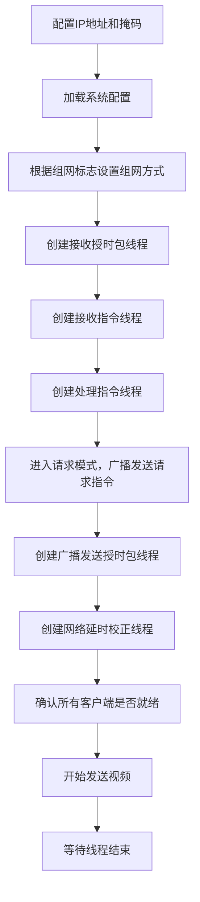

# 流程图

```mermaid
graph TD
    A[配置IP地址和掩码]
    B[加载系统配置]
    C[根据组网标志设置组网方式]
    D[创建接收授时包线程]
    E[创建接收指令线程]
    F[创建处理指令线程]
    G[进入请求模式，广播发送请求指令]
    H[创建广播发送授时包线程]
    I[创建网络延时校正线程]
    J[确认所有客户端是否就绪]
    K[开始发送视频]
    L[等待线程结束]
    A --> B
    B --> C
    C --> D
    D --> E
    E --> F
    F --> G
    G --> H
    H --> I
    I --> J
    J --> K
    K --> L
```
